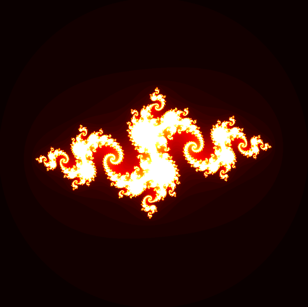
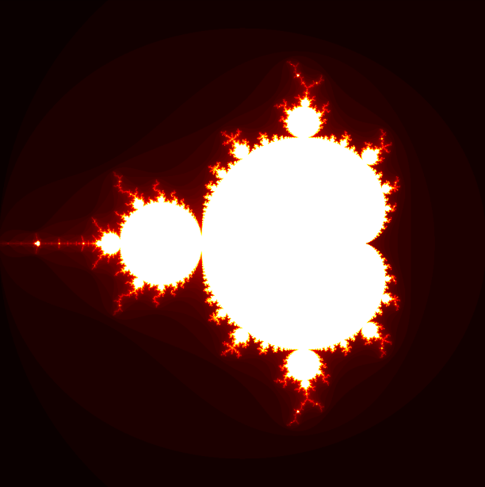
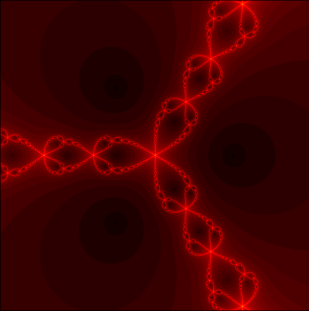

# Fractal Visualizations

This repository contains Python programs for generating and visualizing three popular fractal sets: the Julia set, the Mandelbrot set, and the Newton fractal. Each program uses the `matplotlib` library to generate and display the corresponding fractal.

## Julia Set

The Julia set is a fractal set that is defined by a complex number `c`. It is the set of points `z` in the complex plane for which the iteration `z = z^2 + c` does not diverge to infinity.

The formula for the Julia set is:

`z_{n+1} = z_n^2 + c`

Where `z_0` is the initial point, and `c` is a complex constant.

Here's an example of the Julia set with `c = -0.8 + 0.156j`:



The program to generate the Julia set is `julia.py`.

## Mandelbrot Set

The Mandelbrot set is a famous fractal set that is defined by the set of complex numbers `c` for which the iteration `z = z^2 + c` remains bounded.

The formula for the Mandelbrot set is:

`z_{n+1} = z_n^2 + c`

Where `z_0 = 0`, and `c` is a complex number.

Here's an example of the Mandelbrot set:



The program to generate the Mandelbrot set is `mandelbrot.py`.

## Newton Fractal

The Newton fractal is a fractal set that visualizes the convergence of Newton's method for finding the roots of a complex function `f(z)`.

The formula for Newton's method is:

`z_{n+1} = z_n - f(z_n) / f'(z_n)`

Where `f'(z)` is the derivative of `f(z)`.

Here's an example of the Newton fractal for the function `f(z) = z^3 - 1`:



The program to generate the Newton fractal is `newton.py`.

## Usage

To run these programs, you'll need to have Python and the `matplotlib` and `numpy` installed.
You can run each program by executing the corresponding Python file:
```
python julia.py
python mandelbrot.py
python newton.py
```
Feel free to explore and modify the code to experiment with different parameters and functions for each fractal set.
